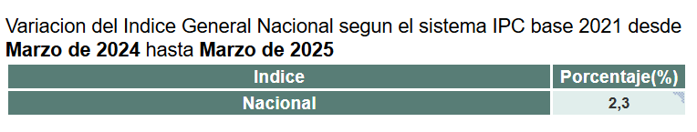

import ArticleCTA from '~/components/blog/ArticleCTA.astro';

## Introducción

> Si ya sabes qué es el IPC y solo quieres ver dónde conseguirlo y cómo calcular tu renta nueva [haz click aquí](#ejemplo-real-de-calculo-del-ipc-en-un-alquiler-en-2025)

> Si quieres ver una lista de herramientas que te ayuden con las actualizaciones de renta [[haz click aquí](#herramientas-y-calculadoras-automaticas)]

Si vives de **alquiler** o tienes una **propiedad alquilada**, es probable que cada año tengas que revisar el contrato para actualizar el precio conforme al **IPC** (Índice de Precios al Consumo). En 2025, este cálculo sigue siendo clave para garantizar que el precio del alquiler se ajuste al **coste de vida** y no pierda valor con el tiempo.

Pero ¿**cómo se calcula** exactamente el IPC? ¿**Dónde** se consultan los **datos oficiales**? ¿Y cómo **aplicarlo correctamente** al alquiler?

Aunque puede parecer algo técnico, en realidad con unos pocos pasos podrás hacer el **cálculo por ti mismo** o verificar si lo han aplicado bien.

En esta **guía práctica** te explicamos de forma clara y sencilla cómo calcular el IPC en España en 2025, especialmente enfocado a **contratos de alquiler**. Aprenderás:

- Qué **datos** necesitas
- Cómo interpretar las **tablas del INE**
- Cómo aplicar la **fórmula** con un ejemplo real
- Veremos **errores comunes**, **trucos útiles** y algunas **herramientas online** que te pueden facilitar el trabajo.

Si quieres saber **cuánto debería subir** (o no) tu alquiler este año, sigue leyendo.

<ArticleCTA />

## ¿Qué es el IPC y por qué importa?

El **Índice de Precios al Consumo (IPC)** es un indicador que mide la evolución del coste de los **bienes y servicios básicos** que consumimos habitualmente: alimentación, transporte, vivienda, ocio, etc. En otras palabras, el IPC refleja cómo **suben o bajan los precios** en España a lo largo del tiempo.

Cada mes, el **Instituto Nacional de Estadística (INE)** publica el dato actualizado del IPC, y una vez al año se utiliza como referencia para actualizar muchos contratos, especialmente los de alquiler. De hecho, la **gran mayoría de contratos** de arrendamiento en España incluyen una cláusula que permite **ajustar el precio del alquiler** conforme al IPC anual.

### ¿Por qué es importante el IPC en 2025?

En los últimos años, España ha experimentado **variaciones significativas** en el IPC debido a la inflación. Esto ha provocado **subidas notables en los alquileres**, especialmente entre 2021 y 2023. En 2024 y 2025, muchos inquilinos y propietarios están especialmente atentos a este índice para saber:

- Si toca subir el alquiler.
- Cuánto se puede subir legalmente.
- Qué índice se debe usar según el contrato.

Además, desde 2023 hay algunas **regulaciones que limitan la subida** anual de los alquileres, por lo que entender el IPC y cómo se aplica es más importante que nunca para evitar **errores o abusos**.

En la siguiente sección veremos dónde puedes consultar el IPC actualizado y cuál es el dato exacto que necesitas para hacer tu cálculo en 2025.

## ¿Dónde consultar el IPC actualizado en 2025?

Para calcular correctamente la subida del alquiler con el IPC, necesitas obtener los **datos oficiales y actualizados**. En España, la **fuente oficial** es el **Instituto Nacional de Estadística (INE)**, que publica cada mes el valor del IPC en su página web.

### 🔎 Paso 1: Acceder a la web del INE

Puedes consultar el IPC actualizado de forma **gratuita y pública** en esta dirección:

👉 <a href="https://www.ine.es/" target="_blank" rel="noopener noreferrer">https://www.ine.es/</a>

Una vez en la web, busca el apartado "**Índice de Precios de Consumo (IPC)**" o escribe directamente en el buscador: **IPC general base 2021**.

### 📊 Paso 2: Identificar el dato que necesitas

Para actualizar un alquiler, lo más habitual es usar el **IPC interanual**, es decir, la variación entre el mes de referencia actual y ese mismo mes del año anterior.

Ejemplo práctico:
Si tu contrato indica que se debe actualizar en mayo de 2025, necesitarás:

- El **IPC mayo 2025**.
- El **IPC de mayo 2024**.

> Ten en cuenta que el IPC de mayo no estará disponible hasta que no se acerque dicho mes

La **variación entre ambos** (en %) es la que se aplica al alquiler.

Lo bueno es que el INE **nos facilita este cálculo** en el siguiente enlace:

👉 <a href="https://www.ine.es/varipc/index.do" target="_blank" rel="noopener noreferrer">https://www.ine.es/varipc/index.do</a>

Aquí podrás ver, de un vistazo, la variación entre el IPC de dos fechas.

💡 Importante: asegúrate de usar la serie **IPC General Nacional (desde enero de 1961)** (no subyacente ni por grupos de productos).

### 🧩 ¿Qué significa "base 2021"?

Cada cierto tiempo, el INE actualiza la forma de calcular el IPC cambiando su "base". En 2025, la **base oficial es 2021**, por lo que todos los cálculos deben hacerse con esta referencia para ser coherentes.

## Fórmula para calcular el IPC aplicado al alquiler

Una vez que ya sabes qué datos del IPC necesitas (normalmente, los valores de dos meses con un año de diferencia), puedes calcular fácilmente cuánto debe actualizarse tu alquiler.

### ✅ Fórmula general

```
Nueva renta = Renta actual + ( Renta actual x variación del IPC )
```

Esta fórmula compara el IPC del mes de actualización con el IPC del mismo mes del año anterior. La proporción resultante se multiplica por tu renta actual para obtener la nueva cantidad.

## Ejemplo real de cálculo del IPC en un alquiler en 2025

Imaginemos que pagas **850 € de alquiler** y tu contrato se actualiza en **marzo de 2025**.

1. Vas a la web del INE (<a href="https://www.ine.es/varipc/index.do" target="_blank" rel="noopener noreferrer">https://www.ine.es/varipc/index.do</a>) e introduces los siguientes datos:


2. Le damos a calcular y nos da el porcentaje de variación:



3. Aplicamos la fórmula:

```
Nueva renta = 850 + (850 * 0,023) ≈ 850 + 19,55 = 869,55 €
```

➡️ **Resultado:** tu alquiler actualizado en marzo de 2025 pasaría de **850 € a 869,55 €**.

<ArticleCTA />

## Casos especiales y errores comunes

Aunque calcular el IPC puede parecer sencillo, hay ciertos matices importantes que pueden afectar el resultado, sobre todo en contratos de alquiler. A continuación, repasamos los casos más comunes que generan dudas o errores.

### 🔄 1. El contrato menciona otro índice (como el IGC)

Algunos contratos antiguos no usan el IPC como referencia, sino el **IGC (Índice de Garantía de Competitividad)** u otros índices menos habituales. En ese caso:

- **Revisa el contrato detenidamente** para ver qué índice se menciona exactamente.
- El IGC, por ejemplo, también lo publica el INE, pero tiene un tope legal del 2%.
- Si no se especifica claramente el IPC, **no debes aplicarlo automáticamente**.

### 📅 2. ¿Qué pasa si el contrato no menciona actualización por IPC?

Si el contrato **no incluye ninguna cláusula** sobre la revisión del alquiler por IPC u otro índice, **no se puede aplicar ninguna subida**, salvo que ambas partes lo acuerden expresamente.

🧠 **Importante:** Desde la Ley de Arrendamientos Urbanos (LAU), solo se permite revisar la renta si hay pacto por escrito en el contrato.

### ⚠️ 3. Errores frecuentes al interpretar el IPC

- **Usar el dato mensual en lugar del interanual.**  
  El IPC mensual indica la variación respecto al mes anterior, no al mismo mes del año pasado. Para actualizar un alquiler, siempre se usa el **dato interanual**.

- **Elegir mal el mes de referencia.**  
  Asegúrate de usar el mes que te indique el contrato. Por defecto, suele ser el **mes en el que se firmó el contrato** o el **último mes completo antes de la renovación**.

- **Calcular con bases distintas.**  
  Si comparas índices con bases diferentes (por ejemplo, IPC base 2016 vs. base 2021), el cálculo será erróneo. Asegúrate de usar siempre la **misma base**, actualmente la de **2021**.

### 🧾 4. Límite legal en la subida del alquiler (Ley de Vivienda)

⚖️ Desde 2023 y hasta finales de 2025, la **Ley de Vivienda** establece un **límite del 3% de subida** para contratos de arrendamiento de vivienda habitual cuando el arrendador es una gran tenedor.

Esto significa que incluso si el IPC marca una subida mayor, **no se puede aplicar más del 3%** en estos casos.

### ✅ Recomendación

Siempre revisa:

- Qué dice exactamente tu contrato.
- Qué índice se aplica.
- Qué mes debe tomarse como referencia.
- Si existen límites legales que condicionen la actualización.

En caso de duda, consulta con un profesional o utiliza una calculadora oficial.

## Herramientas y calculadoras automáticas

Si no quieres hacer el cálculo manualmente o tienes dudas con las fórmulas, existen varias herramientas online que te permiten calcular el IPC aplicado a tu alquiler de forma automática y segura.

A continuación, te mostramos algunas de las opciones más útiles:

### 🧠 **AutoIPC** - Rápido, preciso y pensado para alquileres

👉 <a href="/" target="_blank" rel="noopener noreferrer">AutoIPC</a> es una herramienta diseñada especialmente para **automatizar la subida del alquiler con IPC en España**, de forma
clara y actualizada.

Solo necesitas subir el contrato de alquiler y AutoIPC generará la actualización según el índice estipulado y se lo enviará al inquilino en la fecha correspondiente.

> 🛠️ Ideal para propietarios, grandes tenedores e inmobiliarias que gestionen viviendas de alquiler.

### 🏛️ **Calculadora del INE**

El **Instituto Nacional de Estadística (INE)** también ofrece una herramienta oficial para calcular la variación del IPC:

🔗 <a href="https://www.ine.es/calcula/" target="_blank" rel="noopener noreferrer">https://www.ine.es/calcula/</a>

Aunque es fiable, su interfaz es menos intuitiva que otras opciones y no está pensada específicamente para alquileres.

### 💻 Otras herramientas útiles

- Calculadoras de portales jurídicos como <a href="https://www.idealista.com/" target="_blank" rel="noopener noreferrer">Idealista</a>
- Plantillas Excel personalizadas con fórmulas integradas
- Apps de contabilidad personal o de gestión de alquileres

### ✅ ¿Qué herramienta usar?

Si buscas **rapidez, facilidad y exactitud**, te recomendamos probar <a href="/" target="_blank" rel="noopener noreferrer">**AutoIPC**</a>, ya que simplifica el proceso y te guía paso a paso. Además, se actualiza automáticamente con los datos del INE y te muestra alertas si hay topes legales aplicables.

## Conclusión

Calcular la actualización del alquiler según el IPC en 2025 no tiene por qué ser complicado. Conociendo bien tu contrato, accediendo a los datos correctos del INE y aplicando la fórmula adecuada, puedes saber fácilmente cuánto debe ajustarse tu renta.

En resumen:

- Consulta el **IPC interanual** del mes indicado en tu contrato.
- Usa la fórmula correcta o una herramienta automática como <a href="/" target="_blank" rel="noopener noreferrer">**AutoIPC**</a>.
- Verifica si existen **límites legales** (como el 3% para grandes tenedores).
- Evita errores comunes como usar el dato mensual o mezclar bases distintas.

Ya seas inquilino o propietario, comprender cómo funciona el IPC te ayudará a negociar de forma justa y evitar malentendidos.

Y si prefieres automatizar todo el proceso, recuerda que puedes usar nuestra herramienta gratuita 👇

<ArticleCTA />
